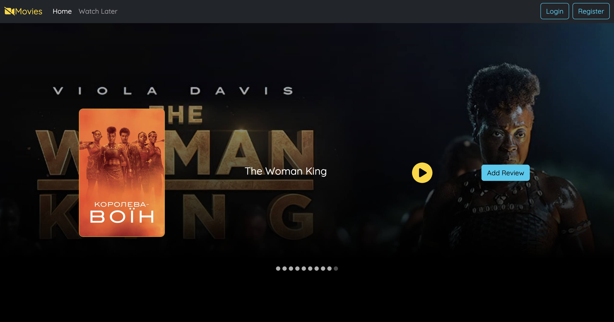

### MovieDisplay Carousel
This project is to display a set of current popular movies to users.
Users can watch the trailer of each movie and can submit a review of the movie after watching.

### Value Proposition
* Users can gauge whether a movie is worth watching based on the trailer and other user's feedback

### Future updates
* Login to personal youtube account
* Have a post comment feature using YT public data APIs.

### Acknowledgement
* This project is following a tutorial - (https://www.youtube.com/watch?v=5PdEmeopJVQ&t=8685s&ab_channel=freeCodeCamp.org)